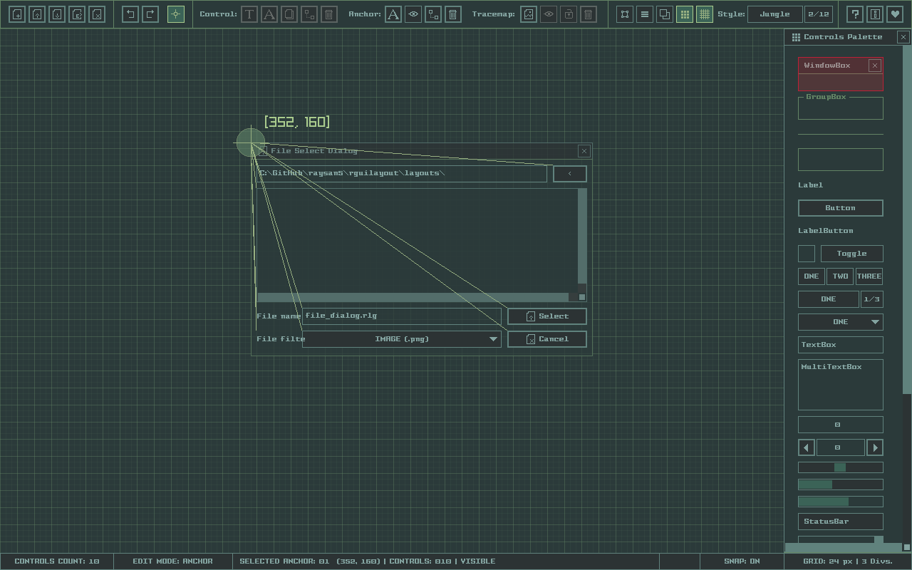

# rGuiLayout

A simple and easy-to-use [raygui](https://github.com/raysan5/raygui) **layouts** editor.

Useful for custom tools layout creation. The best tool companion for [rGuiStyler](https://raylibtech.itch.io/rguistyler) and [rGuiIcons](https://raylibtech.itch.io/rguiicons).

rGuiLayout can be used for free as a [WebAssembly online tool](https://raylibtech.itch.io/rguilayout) and it can also be downloaded as a **standalone tool** for _Windows_ and _Linux_.

 

_NOTE: This tool is itended to be used with [**raygui 3.5-dev**](https://github.com/raysan5/raygui)_

## rGuiLayout Features

 - **25 gui controls to define your immmediate-mode gui layout**
 - Place controls and move/scale them freely
 - Snap to grid mode for maximum precission
 - **Link controls** to anchors for better organization
 - **Edit controls text and code name** (for exported variables)
 - Icon selection panel on control text edition
 - Load/Save your layouts as `.rgl` **text files**
 - Supports `.png` image loading to be used as **tracemap**
 - Support for **custom code templates** to generate your controls code
 - **Export layout directly as plain C code, ready to edit and compile**
 - Multiple GUI styles available with support for custom ones (`.rgs`)
 - **Free and open-source**

### rGuiLayout Standalone Additional Features

 - Command-line support for `.rgl` to `.c`/`.h` conversion
 - **Completely portable (single-file, no-dependencies)**
 
## rGuiLayout Screenshot

 
## rGuiLayout Usage

For detailed usage information, check provided [USAGE.md](https://github.com/raysan5/rguilayout/blob/master/USAGE.md) file.

The tool works with mouse and several key shortcuts that can be viewed with F1 key.

Use mouse wheel to navigate along the available controls or select them on right controls panel, place them on the main grid and scale as required.

Load and Save `.rgl` layout files to keep working on custom layouts.

Export layouts as code, Code Generation Window offers multiple export options to generate the code. 

**To compile generated code, you need `raygui v3.5-dev` library and `raylib v4.5-dev`.**

`rGuiLayout Standalone` comes with command-line support for batch conversion. For usage help:

 > rguilayout.exe --help

## rGuiLayout License

`rGuiLayout` source code is distributed as **open source**, licensed under an unmodified [zlib/libpng license](LICENSE). 

`rGuiLayout` binaries are completely free for anyone willing to compile them directly from source.

`rGuiLayout Standalone` desktop tool could be downloaded with a small donation. 

In any case, consider a donation to help the author keep working on software for games development.

*Copyright (c) 2015-2022 raylib technologies ([@raylibtech](https://twitter.com/raylibtech))*
