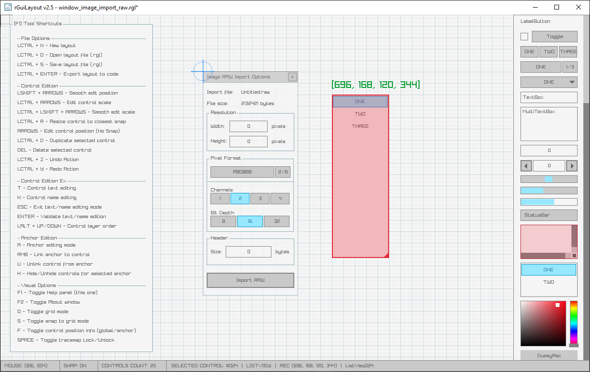

# rGuiLayout

A simple and easy-to-use [raygui](https://github.com/raysan5/raygui) **layouts** editor.

Useful for custom tools layout creation. The best tool companion for [rGuiStyler](https://raylibtech.itch.io/rguistyler) and [rGuiIcons](https://raylibtech.itch.io/rguiicons).

rGuiLayout can be used for free as a [WebAssembly online tool](https://raylibtech.itch.io/rguilayout) and it can also be downloaded as a **standalone tool** for _Windows_ and _Linux_ with some extra features.

 

_NOTE: This tool is itended to be used with [**raygui 3.1**](https://github.com/raysan5/raygui)_

## rGuiLayout Features

 - **24 gui controls to define your immmediate-mode gui layout**
 - Place controls and move/scale them freely
 - Snap to grid mode for maximum precission
 - **Link controls** to anchors for better organization
 - **Edit controls text and code name** (for exported variables)
 - Icon selection panel on control text edition
 - Save/Load your layout as `.rgl` **text file**
 - Supports `.png` image loading to be used as **tracemap**
 - **Export layout directly as plain C code, ready to edit and compile**

### rGuiLayout Standalone Additional Features

 - Support for more than 16 controls per layout
 - Command-line support for `.rgl` to `.h` conversion
 - Support for **custom code templates** to place your controls on
 - **Completely portable (single-file, no-dependencies)**
 
## rGuiLayout Screenshot

 
## rGuiLayout Usage

The tool works with mouse and several key shortcuts, when opening the tool the shortcuts key info is automatically displayed (F1 key).

Use mouse wheel to navigate along the available controls or select them on right controls panel, place them on the main grid and scale as required.

Drag&drop `.rgl` layout files for automatic loading and save changes with `LCTRL + S` or `LCTRL + LSHIFT + S`.

Press `LCTRL + ENTER` to show code generation window, you can configure multiple export options to generate the code. 

**To compile generated code, you need `raygui v3.1-dev` library and `raylib v4.0`.**

`rGuiLayout Standalone` comes with command-line support for batch conversion. For usage help:

 > rguilayout.exe --help

## rGuiLayout License

`rGuiLayout` online tool can be used completely for free.

`rGuiLayout Standalone` desktop tool could be downloaded with a small donation. 

In any case, consider a donation to help the author keep working on software for games development.

*Copyright (c) 2015-2022 raylib technologies ([@raylibtech](https://twitter.com/raylibtech))*

